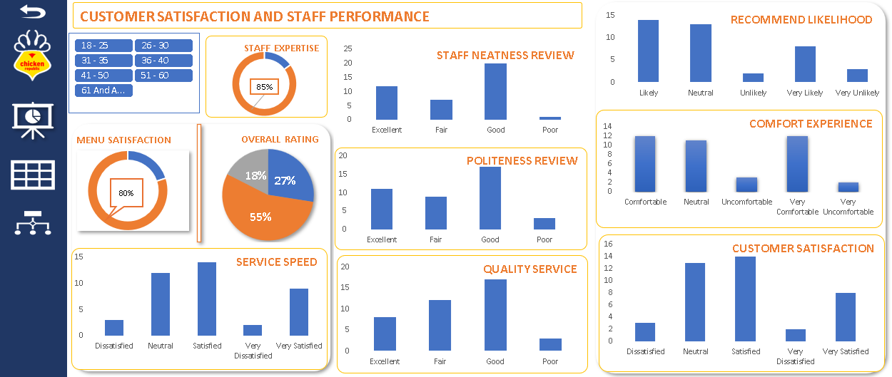
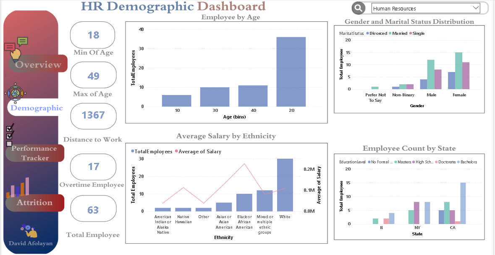

# Data Analyst & Quality Assurance Engineer

## Introduction
A driven and analytical professional, I excel at bridging the gap between raw data and practical business solutions. My expertise lies in both Data Analysis and Business Analysis, complemented by a background in QA Engineering, where I'm passionate about uncovering clear, actionable insights that truly inform strategic decisions, boost performance, and support stakeholder decision-making. Committed to continuous learning and application of advanced techniques as an active member of the DSN community, I am dedicated to leveraging data to solve real-world problems and deliver tangible results.

## RESUME
Feel Free to explore my [Resume]()

## Project
### BMW Car Sales Report 

### Telco Customer Retention Report

### Hospitality Reports

### HR Analytics

## Contact Me

Connect with me on [LinkedIn](), [Twitter](), or reach out via [Email]()
