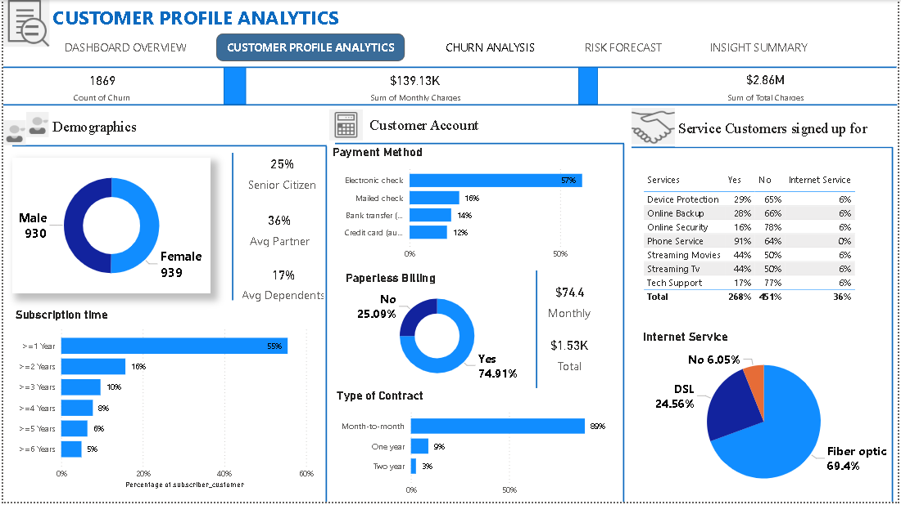

## Resume
Feel free to explore my [Resume](https://drive.google.com/file/d/1ncgldoHaIthK-pz-hVEnbk_JJ42p4itk/view?usp=sharing).

---

## Projects

### BMW Car Sales Report 

This Power BI dashboard offers a comprehensive view of BMW's global sales from 2019-2023, analyzing revenue, unit volumes, and growth across geographies and channels. It reveals key insights like top-selling models (BMW Z4) and high-grossing regions (Mexico, U.S.), empowering strategic decisions.

**Tools Used:** Power BI, CSV

[View Full Project](https://github.com/Tolu-DavidAfolayan/BMW_CAR_SALES)

---

### Retail Transaction Analysis

This project analyzes retail transaction data from 2009-2011 using Python libraries like Pandas, Matplotlib, and Scikit-learn. I performed data wrangling, exploratory data analysis (EDA) to uncover sales trends, and customer segmentation using K-Means, DBSCAN, and Hierarchical clustering. The insights provide actionable strategies for optimizing inventory, retaining high-value customers, and improving overall business performance.

**Tools Used:** Python (Pandas, Matplotlib, Seaborn, Scikit-learn), Microsoft Excel

[View Full Project](https://github.com/Tolu-DavidAfolayan/Retail-Transaction-Data)

---

### Telco Customer Retention 

This Power BI dashboard offers a comprehensive solution for Telco Customer Churn analysis. It dissects customer demographics and service usage to identify churn drivers and at-risk customers. Through interactive visualizations, it empowers stakeholders to develop targeted strategies for improved customer retention.

**Tools Used:** Microsoft Excel, PowerBi

[View Full Project](https://github.com/Tolu-DavidAfolayan/Telco_customer_retention_analysis)

---

### World Cup Analytics

This SQL project analyzed the FIFA World Cup 2022 data. I structured the database, created functions and views for efficient data access, and performed in-depth group, match, and squad analysis. This work focused on performance optimization and extracting actionable insights from the tournament's statistics.

**Tools Used:** SQL (PostgreSQL), Database Management System (DBMS)

[View Full Project](https://github.com/Tolu-DavidAfolayan/SQL-Scripts-for-Comprehensive-World-Cup-Analytics)

---

### E-commerce Analytics

This project analyzes e-commerce transaction data, performing comprehensive data wrangling, exploratory data analysis, and predictive modeling. I developed a Random Forest Classifier to predict delivery status, achieving **95% accuracy**. Key insights include monthly sales trends, shipping type distribution, and feature importance for delivery prediction.

**Tools Used:** Python (Pandas, NumPy, Matplotlib, Seaborn, Scikit-learn, Plotly)

[View Full Project](https://github.com/Tolu-DavidAfolayan/E_Commerce_Dataset)

---

## Connect with Me

---
